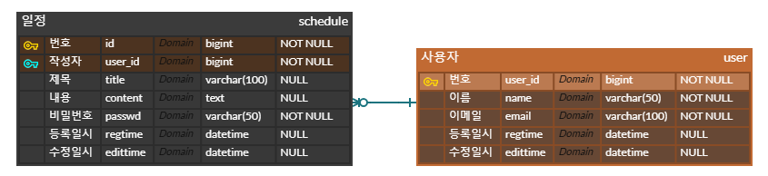

# SchedulerProject

## API 명세서
|기능|method|url|request|response|status|
|----|---|---|---|---|---|
|신규일정 생성|`POST`  |/api/schedules              |요청 body  |등록 정보      |201: 정상 등록|
|전체일정 조회|`GET`   |/api/schedules              |요청 param |다건 응답 정보  |200: 정상 조회|
|선택일정 조회|`GET`   |/api/schedules/{schedule_id}|요청 param |단건 응답 정보  |200: 정상 조회|
|선택일정 수정|`PATCH` |/api/schedules/{schedule_id}|요청 body  |수정 정보      |200: 정상 수정, 403: 비밀번호오류|
|선택일정 삭제|`DELETE`|/api/schedules/{schedule_id}|요청 param |삭제 정보      |200: 정상 삭제, 403: 비밀번호오류|

<details>
  <summary>신규일정 생성</summary>
<table>
<tr>
<td>  </td> <td> Request </td> <td> Response </td>
</tr>
<tr>
<td> Start Line </td>
<td> POST  /api/schedules  HTTP/1.1</td>
<td> HTTP/1.1  201  Created </td>
</tr>
<tr>
<td> Header </td>
<td>Content-Type:application/json</td>
<td>Content-Type:application/json</td>
</tr>
<tr>
<td> Empty Line </td>
<td></td>
<td></td>
</tr>
<tr>
<td> Message Body</td>
<td>

```json
{
	"title" : "제목",
	"content" : "내용",
	"userId" : "작성자",
	"passwd" : "비밀번호"
	}
```
 
</td>
<td>

```json
{
	"id" : "번호",
	"title" : "제목",
	"content" : "내용",
	"passwd" : "비밀번호",
	"userId" : "작성자",
	"regtime" : "생성일시",
	"edittime" : "수정일시"
	}
```
 
</td>
</tr>
</table>
</details>


<details>
  <summary>전체일정 조회</summary>
<table>
<tr>
<td>  </td> <td> Request </td> <td> Response </td>
</tr>
<tr>
<td> Start Line </td>
<td> GET  /api/schedules  HTTP/1.1</td>
<td> HTTP/1.1  200  OK </td>
</tr>
<tr>
<td> Header </td>
<td>Host:localhost:8080</td>
<td>Content-Type:application/json</td>
</tr>
<tr>
<td> Empty Line </td>
<td></td>
<td></td>
</tr>
<tr>
<td> Message Body</td>
<td>
 
</td>

```json
{
	"userId" : "작성자",
	"edittime" : "수정일시"
	}
```

<td>

```json
{
	"id" : "번호",
	"title" : "제목",
	"content" : "내용",
	"passwd" : "비밀번호",
	"userid" : "작성자",
	"regtime" : "생성일시",
	"edittime" : "수정일시"
	}
```
 
</td>
</tr>
</table>
</details>


<details>
  <summary>선택일정 조회</summary>
<table>
<tr>
<td>  </td> <td> Request </td> <td> Response </td>
</tr>
<tr>
<td> Start Line </td>
<td> GET  /api/schedules?id={id}  HTTP/1.1</td>
<td> HTTP/1.1  200  OK </td>
</tr>
<tr>
<td> Header </td>
<td>Host:localhost:8080</td>
<td>Content-Type:application/json</td>
</tr>
<tr>
<td> Empty Line </td>
<td></td>
<td></td>
</tr>
<tr>
<td> Message Body</td>
<td>
 
</td>
<td>

```json
{
	"id" : "번호",
	"title" : "제목",
	"content" : "내용",
	"passwd" : "비밀번호",
	"userid" : "작성자",
	"regtime" : "생성일시",
	"edittime" : "수정일시"
	}
```
 
</td>
</tr>
</table>
</details>


<details>
  <summary>선택일정 수정</summary>
<table>
<tr>
<td>  </td> <td> Request </td> <td> Response </td>
</tr>
<tr>
<td> Start Line </td>
<td> PATCH  /api/schedules/{id}  HTTP/1.1</td>
<td> HTTP/1.1  200  OK </td>
</tr>
<tr>
<td> Header </td>
<td>Content-Type:application/json</td>
<td>Content-Type:application/json</td>
</tr>
<tr>
<td> Empty Line </td>
<td></td>
<td></td>
</tr>
<tr>
<td> Message Body</td>
<td>

```json
{
	"title" : "제목",
	"content" : "내용",
	"userId" : "작성자",
	"passwd" : "비밀번호"
	}
```
 
</td>
<td>

```json
{
	"id" : "번호",
	"title" : "제목",
	"content" : "내용",
	"passwd" : "비밀번호",
	"userid" : "작성자",
	"regtime" : "생성일시",
	"edittime" : "수정일시"
	}
```
 
</td>
</tr>
</table>
</details>


<details>
  <summary>선택일정 삭제</summary>
<table>
<tr>
<td>  </td> <td> Request </td> <td> Response </td>
</tr>
<tr>
<td> Start Line </td>
<td> DELETE  /api/schedules?id={id}  HTTP/1.1</td>
<td> HTTP/1.1  200  OK </td>
</tr>
<tr>
<td> Header </td>
<td>Host: localhost:8080</td>
<td></td>
</tr>
<tr>
<td> Empty Line </td>
<td></td>
<td></td>
</tr>
<tr>
<td> Message Body</td>
<td>

```json
{
	"passwd" : "비밀번호"
	}
```
 
</td>
<td></td>
</tr>
</table>
</details>

---
## ERD

https://www.erdcloud.com/d/sJoeoXvDutmdC4neW


---
## SQL
```sql
-- 테이블 생성 QUERY
CREATE TABLE schedule
(
    id       BIGINT AUTO_INCREMENT primary key comment '일정 식별자',
    title    varchar(100) NOT NULL COMMENT '제목',
    content  TEXT COMMENT '내용',
    user_id  bigint not null comment '작성자',
    passwd   varchar(50)  NOT NULL COMMENT '작성글 비밀번호',
    regtime  datetime comment '등록일시',
    edittime datetime comment '수정일시'
);

CREATE TABLE user
(
    user_id     bigint  primary key comment '유저 식별자',
    name        varchar(50) not null comment '이름',
    email       varchar(100) not null comment '이메일',
    regtime  datetime comment '등록일시',
    edittime datetime comment '수정일시'
);

ALTER TABLE `schedule` ADD CONSTRAINT `FK_user_TO_schedule_1` FOREIGN KEY (
                                                                           `user_id`
    )
    REFERENCES `user` (
                       `user_id`
        );


-- 일정 생성 QUERY
INSERT INTO SCHEDULE (PASSWD, TITLE, CONTENT, USER_ID, REGTIME, EDITTIME)
	       VALUE (:PASSWD, :TITLE, :CONTENT, :USER_ID, SYSDATE(), SYSDATE())


-- 전체 일정 조회 QUERY
SELECT ID, PASSWD, TITLE, CONTENT, USER_ID, REGTIME, EDITTIME
  FROM SCHEDULE
 WHERE DATE_FORMAT(EDITTIME, '%Y-%m-%d') = :EDITTIME
    OR USER_ID = :USER_ID
 ORDER BY EDITTIME DESC


-- 선택 일정 조회 QUERY
SELECT *
  FROM SCHEDULE
 WHERE ID = :ID


-- 선택 일정 수정 QUERY
UPDATE SCHEDULE
   SET TITLE = :TITLE,
       CONTENT = :CONTENT,
       USER_ID = :USER_ID,
       EDITTIME = SYSDATE()
 WHERE ID = :ID


-- 선택 일정 삭제 QUERY
DELETE FROM SCHEDULE
 WHERE ID = :ID
```
